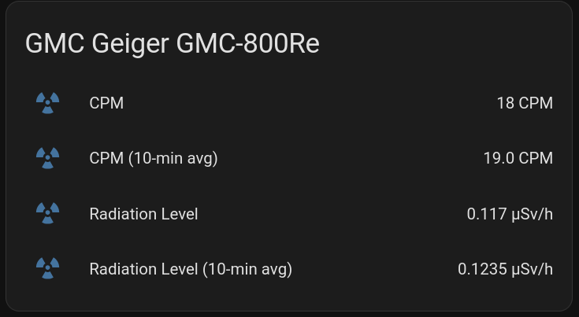
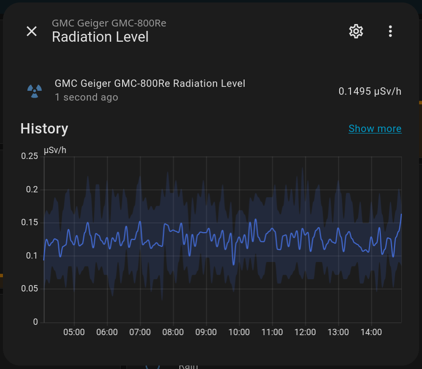

# GMC Geiger Counter to MQTT Bridge

A Python application for reading radiation data from GMC Geiger counters and publishing it via MQTT.

## Status

**Current Phase:** ✅ Fully functional MQTT bridge!

✅ Implemented:
- Serial communication with GMC devices (GQ-RFC1801 protocol)
- **CPM reading (4-byte, 32-bit)** - correctly implemented
- µSv/h conversion
- Device info retrieval (model, version, serial)
- Configuration system (YAML-based)
- Polling-only mode (no heartbeat)
- **MQTT publishing** (realtime and aggregated)
- **Moving average calculation** (configurable time window)
- **Service mode** with automatic reconnection
- **Home Assistant MQTT discovery**
- Graceful shutdown handling

🚧 Not yet implemented:
- Web UI
- Additional output plugins (InfluxDB, etc.)

## Requirements

- Python 3.8+
- GMC Geiger counter (tested with GMC-800 v1.10, should work with GMC-500/600 series)
- USB connection to the device
- MQTT broker (e.g., Mosquitto) - optional for MQTT features

## Installation

1. Clone the repository:
```bash
git clone <repository-url>
cd gmc-geiger-mqtt
```

2. Install using uv:
```bash
# Install uv if not already installed
curl -LsSf https://astral.sh/uv/install.sh | sh

# Create virtual environment
uv venv

# Activate venv
source .venv/bin/activate  # On Linux/Mac
# Or: .venv\Scripts\activate  # On Windows

# Install package in editable mode
uv pip install -e .

# Or install with development dependencies (includes pytest, ruff, etc.)
uv pip install -e ".[dev]"
```

3. Ensure your user has access to the serial port:
```bash
sudo usermod -a -G dialout $USER
```
Then logout and login, or use `sg dialout -c "command"`.

## Configuration

Edit `config.yaml`:

```yaml
# Serial device configuration
device:
  port: "/dev/ttyUSB0"
  baudrate: 115200      # GMC-800 uses 115200!
  timeout: 5.0

# Sampling configuration
sampling:
  interval: 1           # Seconds between readings
  aggregation_window: 600    # Moving average window (10 minutes)
  aggregation_interval: 600  # Publish aggregated data every 10 minutes

# MQTT configuration
mqtt:
  enabled: true         # Set to false for test mode (no MQTT)
  broker: "localhost"
  port: 1883
  username: ""          # Leave empty for anonymous
  password: ""
  topic_prefix: "gmc/geiger"
  homeassistant_discovery: true

# Conversion factor
conversion:
  cpm_to_usv_factor: 0.0065  # Adjust for your device/tube
```

**Critical:** Baudrate is **115200** for GMC-800, not 57600 as specified in GQ-RFC1801!

## Usage

### Service Mode (with MQTT)

Run the bridge in service mode with MQTT publishing:

```bash
# Make sure MQTT broker is running (e.g., mosquitto)
# and mqtt.enabled is set to true in config.yaml

gmc-geiger-mqtt

# If not in dialout group, use sg:
sg dialout -c "gmc-geiger-mqtt"
```

The service will:
- Connect to the GMC device and MQTT broker
- Publish realtime CPM readings every second to `gmc/geiger/<device_id>/state`
- Publish 10-minute averaged readings to `gmc/geiger/<device_id>/state_avg`
- Register sensors in Home Assistant (if enabled)
- Handle graceful shutdown on Ctrl+C or SIGTERM

### Test Mode (without MQTT)

Test serial communication without MQTT (set `mqtt.enabled: false` in config.yaml):

```bash
gmc-geiger-mqtt

# If not in dialout group:
sg dialout -c "gmc-geiger-mqtt"
```

Expected output:
```
======================================================================
Starting GMC Geiger test mode
Device: /dev/ttyUSB0 @ 115200 baud
======================================================================
Connected to device: GMC Device: GMC-800Re (v1.10, serial=05004D323533AB)
======================================================================
Starting continuous reading mode (Ctrl+C to stop)...
======================================================================
[   1] 03:09:11 | CPM:   19 | µSv/h: 0.1235
[   2] 03:09:13 | CPM:   22 | µSv/h: 0.1430
[   3] 03:09:15 | CPM:   21 | µSv/h: 0.1365
...
```

Press Ctrl+C to stop.

## Project Structure

```
gmc-geiger-mqtt/
├── config.yaml           # Configuration file
├── pyproject.toml        # Python package configuration
├── src/
│   └── gmc_geiger_mqtt/  # Main package (note: underscore!)
│       ├── __init__.py
│       ├── main.py       # Application entry point (service & test mode)
│       ├── config.py     # Configuration loader
│       ├── gmc_device.py # GMC device communication (polling-only)
│       ├── models.py     # Domain models (Reading, DeviceInfo, MQTTConfig, etc.)
│       ├── mqtt/         # MQTT client and publishing
│       │   ├── client.py    # MQTT client wrapper with auto-reconnect
│       │   ├── publisher.py # Publishing logic for readings
│       │   └── discovery.py # Home Assistant MQTT discovery
│       └── processing/   # Data processing
│           └── aggregator.py # Moving average aggregator
├── tests/                # Automated unit tests (no hardware required)
│   ├── conftest.py
│   ├── test_models.py
│   └── test_aggregator.py
├── manual_tests/         # Manual hardware tests (excluded from pytest)
│   ├── README.md         # Documentation for manual tests
│   ├── test_serial.py    # Serial communication tests
│   ├── test_cpm_debug.py # CPM reading debugging
│   └── test_mqtt_messages.py # MQTT integration tests
├── ARCHITECTURE.md       # Detailed architecture documentation
└── GQ-RFC1801.txt        # GMC protocol specification
```

## Architecture

See [ARCHITECTURE.md](ARCHITECTURE.md) for detailed documentation.

**Key Points:**
- **Polling-only mode** - No heartbeat command (not supported by GMC-800)
- **4-byte CPM reading** - 32-bit unsigned integer, MSB first
- **Clean separation** - Device, Processing, MQTT layers
- **Configuration-driven** - All settings in config.yaml
- **Moving average** - Configurable time window for noise reduction
- **Home Assistant integration** - Automatic sensor discovery via MQTT
- **Graceful shutdown** - Publishes offline status on exit

## Important Implementation Details

### CPM Reading (4 bytes!)

The GMC device returns CPM as **4 bytes** (32-bit unsigned integer):

```python
# Send command
serial.write(b"<GETCPM>>")

# Read 4 bytes (MSB first)
data = serial.read(4)

# Parse: data[0] = MSB, data[3] = LSB
cpm = (data[0] << 24) | (data[1] << 16) | (data[2] << 8) | data[3]
```

Example: `0x00 0x00 0x00 0x1C` = 28 CPM

### No Heartbeat Mode

The GMC-800 v1.10 **does not support** the `<HEARTBEAT>>` command. We use **polling-only**:
- Send `<GETCPM>>` every N seconds
- Wait ~100-200ms for response
- Parse and process

### Buffer Management

**Critical:** Clear input buffer before each command:
```python
serial.reset_input_buffer()  # Prevent stale data!
serial.write(command)
serial.flush()
```

### DTR/RTS Activation

Required for CH340 USB-Serial chips:
```python
serial.setDTR(True)
serial.setRTS(True)
```

## Known Issues

1. **GMC-800 baudrate**: Uses 115200, not 57600 (contrary to GQ-RFC1801)
2. **CPM is 4 bytes**: Many examples incorrectly show 2 bytes
3. **No heartbeat support**: GMC-800 v1.10 doesn't respond to `<HEARTBEAT>>`
4. **Version string**: No guaranteed null terminator, variable length

## Troubleshooting

### Permission denied on /dev/ttyUSB0
```bash
sudo usermod -a -G dialout $USER
# Then logout/login or use: sg dialout -c "gmc-geiger-mqtt"
```

### Reading 0 CPM when device shows higher value
- Check baudrate (GMC-800 = 115200)
- Verify 4-byte reading (not 2-byte)
- Check buffer clearing before commands

### Wrong baudrate
Try `test_serial.py` to test different baudrates:
```bash
sg dialout -c "python3 test_serial.py"
```

## MQTT Topics

When running in service mode, the following MQTT topics are published:

- `gmc/geiger/<device_id>/state` - Realtime CPM readings (every 1s)
  ```json
  {"cpm": 28, "usv_h": 0.182, "timestamp": "2024-01-15T10:30:45Z", "unit": "CPM"}
  ```

- `gmc/geiger/<device_id>/state_avg` - 10-minute averaged readings
  ```json
  {
    "cpm_avg": 25.4, "cpm_min": 18, "cpm_max": 35,
    "usv_h_avg": 0.1651, "window_minutes": 10,
    "sample_count": 600, "timestamp": "2024-01-15T10:30:00Z", "unit": "CPM"
  }
  ```

- `gmc/geiger/<device_id>/availability` - Online/offline status (retained)
- `gmc/geiger/<device_id>/info` - Device information (retained)

## Home Assistant Integration

When `homeassistant_discovery: true` is set, the bridge automatically registers four sensors:

1. **CPM** - Realtime counts per minute
2. **Radiation Level** - Realtime radiation in µSv/h
3. **CPM (10-min avg)** - Averaged counts per minute
4. **Radiation Level (10-min avg)** - Averaged radiation in µSv/h

No manual configuration needed - sensors appear automatically in Home Assistant!

### Screenshots

#### Home Assistant Sensors



The bridge automatically creates four sensors in Home Assistant showing realtime and averaged radiation measurements.



Example of MQTT messages being published to the broker, showing realtime readings, averaged data, and device information.

## Development

### Setup Development Environment

```bash
# Clone and navigate to repository
git clone <repository-url>
cd gmc-geiger-mqtt

# Create virtual environment
uv venv

# Install with development dependencies
uv pip install -e ".[dev]"
```

### Development Tools

The project uses modern Python tooling:

- **pytest** - Testing framework
- **pytest-cov** - Test coverage reporting
- **ruff** - Fast linting and formatting

### Common Development Tasks

```bash
# Run all tests
make test

# Run tests with coverage
make test-cov

# Lint code
make lint

# Format code
make format

# Run all checks (lint + format-check + test)
make check-all

# Clean build artifacts
make clean

# Build distribution packages
make build
```

Or use the commands directly:

```bash
pytest                                    # Run tests
pytest --cov=src --cov-report=html       # With coverage
ruff check src/ tests/                   # Lint
ruff format src/ tests/                  # Format
```

### Code Quality

The project follows modern Python best practices:

- **PEP 8** style guide (enforced by ruff)
- **Type hints** where applicable
- **Docstrings** for all public APIs
- **Unit tests** for core functionality
- **Import sorting** with ruff

### Project Structure

See [ARCHITECTURE.md](ARCHITECTURE.md) for detailed architecture documentation.

## Next Steps

1. ✅ Test serial communication
2. ✅ Implement MQTT publishing
3. ✅ Implement moving average calculation
4. ✅ Add continuous service mode
5. ✅ Add Home Assistant MQTT discovery
6. ✅ Create proper Python package (pyproject.toml)
7. Add systemd service for autostart
8. Add additional output plugins (InfluxDB, etc.)
9. Add Web UI (future)

## Testing

### Automated Unit Tests

The project has automated unit tests that run **without hardware** (suitable for CI/CD):

```bash
# Activate virtual environment
source .venv/bin/activate

# Run all automated tests
pytest

# Run with coverage
pytest --cov=src

# Run specific test file
pytest tests/test_models.py
pytest tests/test_aggregator.py
```

**What's tested:**
- Domain models (`Reading`, `DeviceInfo`, `MQTTConfig`, etc.)
- `MovingAverageAggregator` logic
- Data validation and transformations

**Note:** These tests do **not** require a physical GMC device and will run in CI/CD environments.

### Manual Hardware Tests

Manual tests that require a **physical GMC device** are located in `manual_tests/`:

```bash
# Test serial communication with different baudrates
sg dialout -c "python3 manual_tests/test_serial.py"

# Test CPM reading with detailed debugging
sg dialout -c "python3 manual_tests/test_cpm_debug.py"

# Test MQTT integration (requires MQTT broker)
sg dialout -c "python3 manual_tests/test_mqtt_messages.py"
```

**Important:** These tests are **excluded** from `pytest` (see `pytest.ini`) and must be run manually. They require:
- Physical GMC device connected to `/dev/ttyUSB0`
- User in `dialout` group
- For MQTT tests: Running MQTT broker

See [`manual_tests/README.md`](manual_tests/README.md) for detailed documentation.

### MQTT Monitoring

Monitor MQTT messages in real-time:

```bash
# Subscribe to all topics
mosquitto_sub -h localhost -t "gmc/geiger/#" -v

# Subscribe to realtime readings only
mosquitto_sub -h localhost -t "gmc/geiger/+/state"

# Subscribe to averaged readings only
mosquitto_sub -h localhost -t "gmc/geiger/+/state_avg"
```

## License

TBD
